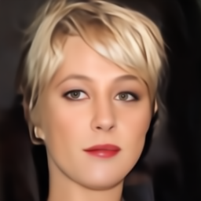

# Flow-Matching: Efficient Continuous-Time Diffusion Models

[English](README.md) | [中文](README_zh.md)

[](https://doi.org/10.5281/zenodo.17110046)
[](https://www.python.org/downloads/)
[](https://pytorch.org/)
[](LICENSE)

A lightweight and efficient PyTorch framework for **Flow-Matching**, a modern approach to continuous-time diffusion models. This project demonstrates how to achieve high-quality image generation with significantly fewer parameters and computational resources.

<p align="center">
  
   
</p>

Download our trained model:
[Click to Download Model Weights](https://drive.google.com/file/d/1jzkRGL_ZqgXaFskdXpLxoU__KSgnMz4X/view?usp=drive_link)

## 🏆 Performance Highlights

This project demonstrates exceptional efficiency, achieving a strong FID score on a high-resolution dataset with a remarkably small model and short training time.

-   **Dataset**: CelebA-HQ 256x256
-   **FID Score**: **47.39**
-   **Model**: DiT (Diffusion Transformer) with only **38.75M** parameters
-   **Training Time**: Just **~20 hours** on 6x NVIDIA RTX 4090 GPUs

These results highlight the power of combining Flow-Matching with an efficient DiT architecture in the latent space, making high-quality generative modeling more accessible.

## 🚀 Key Features

-   **Efficient & Fast**: Achieves an FID of 47.39 on CelebA-HQ 256x256 with only ~20 hours of training.
-   **Lightweight Model**: The DiT model has only **38.75M** parameters, significantly smaller than typical models for this task.
-   **Cutting-Edge Architecture**: Implements a state-of-the-art framework combining Flow-Matching with a Diffusion Transformer (DiT) in the VAE latent space.
-   **Modular and Config-Driven**: Easily experiment with different models and schedulers using YAML configuration files.
-   **Multi-GPU Support**: Includes optimized scripts for distributed training and sampling.

## 🔧 Model Configuration & Training

This project's success lies in its efficient model configuration. We use a two-stage approach:

1.  **VAE Compression**: A fine-tuned `AutoencoderKL` (VAE) is used to compress high-resolution 256x256x3 images from the CelebA-HQ dataset into a much smaller 32x32x4 latent representation. This significantly reduces the computational load for the diffusion model.

2.  **Diffusion Transformer (DiT)**: A `DiT` model with the following configuration is trained on the latent space:
    -   **Input Size**: 32x32
    -   **Input Channels**: 4
    -   **Patch Size**: 2
    -   **Model Dimension**: 512
    -   **Transformer Blocks**: 8
    -   **Attention Heads**: 16
    -   **Total Parameters**: **38.75M**

This setup allows us to achieve high-quality image generation while minimizing computational and memory requirements, making it an excellent example of efficient diffusion model design.

## 📁 Project Structure

This project adopts a highly modular architecture to ensure a clear separation of concerns, enhancing scalability and maintainability. This design makes it easy to experiment with new models, data, or training procedures.

```
Flow-Matching/
├── configs/              # Experiment configurations (YAML files)
│   └── celebahq_dit.yaml
|
├── data_processing/      # Scripts for data downloading and preprocessing
│   ├── download_celeba_hq.py
│   └── init_dataset.py
|
├── fm_scheduler/         # Core Flow Matching logic
│   ├── FlowsBase.py      # Base classes for flow definitions
│   ├── OTScheduler.py    # Optimal Transport schedulers
│   └── Sampler.py        # ODE/SDE samplers
|
├── models/               # Core neural network architectures
│   ├── DiT.py            # Diffusion Transformer (DiT) model
│   └── Unet.py           # UNet model
|
├── modules/              # Reusable components and sub-modules
│   ├── autoencoderkl.py  # VAE model for latent space encoding/decoding
│   ├── embedders.py      # Text and class embedders
│   └── perceptual_module.py # Perceptual loss modules (e.g., VGG)
|
├── scripts/              # Executable scripts for various tasks
│   ├── train/            # Training scripts
│   │   └── train.py
│   ├── compute_fid.py    # FID score computation
│   └── sample_celebahq.py # Image generation scripts
|
└── trainer/              # High-level training orchestration
    ├── Trainer.py        # Main trainer class for the generative model
    └── AutoencoderKL_trainer.py # Trainer for the VAE
```

## 🛠️ Installation

### Prerequisites
- Python 3.8 or higher
- CUDA-compatible GPU (recommended)

### Quick Setup

1.  **Clone the repository**
```bash
git clone https://github.com/your-username/Flow-Matching.git
cd Flow-Matching
```
And download the trained model from the link above.

2.  **Install dependencies**
```bash
pip install -r requirements.txt
```

## 🚀 Quick Start

### 1. Choose Your Configuration

Select a configuration from the `configs/` directory. For example, `celebahq_dit.yaml` is configured for the CelebA-HQ dataset.

### 2. Generate Samples

Use the `scripts/batch_sample.py` script to generate images. You can run it in single-GPU or multi-GPU mode.

**Single-GPU:**
```bash
python scripts/batch_sample.py
```

**Multi-GPU (e.g., with 2 GPUs):**
```bash
torchrun --nproc_per_node=2 scripts/batch_sample.py
```

## 📚 Citation

If you use this code in your research, please cite the original papers and this repository.

## 📄 License

This project is licensed under the MIT License.
